# System Workflow

## Step 0: Authentication

1. **User Login**: A user sends a login request to the `gateway` microservice with their credentials (e.g., username, password).
2. **JWT Creation**: The `gateway` microservice creates a JSON Web Token (JWT) for the user.
3. **JWT Return**: The `gateway` microservice returns the JWT to the user.

## Step 1: Gateway

1. **Incoming Request**: The `gateway` microservice receives an incoming request from a user.
2. **Request Processing**: The `server.py` file processes the request and handles authentication and authorization.
3. **SQL Database Query**: The `gateway` microservice queries the SQL database (e.g., PostgreSQL) to retrieve user information and authentication data.
4. **User Information Retrieval**: The `gateway` microservice retrieves the user information and authentication data from the SQL database.

## Step 2: Authentication

1. **Auth Microservice Call**: The `gateway` microservice calls the `auth` microservice to authenticate the user's credentials.
2. **Auth Database Query**: The `auth` microservice queries the SQL database (e.g., PostgreSQL) to retrieve authentication data and user information.
3. **Authentication**: The `auth` microservice authenticates the user's credentials using the retrieved data.
4. **Token or Response Return**: If authentication is successful, the `auth` microservice returns a token or authentication response to the `gateway` microservice.

## Step 3: File Upload

1. **File Upload Request**: If the user is authenticated, the `gateway` microservice allows the user to upload a file.
2. **File Upload Processing**: The `gateway` microservice processes the file upload request and sends the uploaded file to the `converter` microservice.
3. **Converter Microservice Call**: The `converter` microservice receives the uploaded file and processes it.
4. **MongoDB Database Query**: The `converter` microservice queries the MongoDB database to store metadata about the uploaded files, such as file names, sizes, and formats.

## Step 4: File Conversion

1. **File Conversion**: The `converter` microservice performs the necessary conversions (e.g., format, size, etc.) on the uploaded file.
2. **Converted File Storage**: The converted file is stored in the MongoDB database.
3. **Message Broker Notification**: The `converter` microservice sends a notification to the message broker (e.g., RabbitMQ) to trigger further processing.
4. **Message Broker Processing**: The message broker processes the notification and triggers the `notification` microservice.

## Step 5: Notification

1. **Notification Microservice Call**: The `notification` microservice is triggered by the message broker to send notifications to the user (e.g., email, SMS, etc.).
2. **Notification Data Retrieval**: The `notification` microservice retrieves notification data and user preferences from the SQL database (e.g., PostgreSQL).
3. **Notification Processing**: The `notification` microservice processes the notification data and user preferences.
4. **Notification Sending**: The `notification` microservice sends the notification to the user.

## Step 6: File Storage

1. **File Storage Location**: The converted file is stored in a designated storage location (e.g., cloud storage, file system, etc.).
2. **MongoDB Database Query**: The `converter` microservice queries the MongoDB database to store the file storage locations and metadata.
3. **File Storage Metadata**: The `converter` microservice stores the file storage metadata in the MongoDB database.

## System Components

1. **Gateway Microservice**: Handles incoming requests, authentication, and authorization.
2. **Auth Microservice**: Authenticates user credentials.
3. **Converter Microservice**: Converts files and stores metadata.
4. **Notification Microservice**: Sends notifications to users.
5. **SQL Database**: Stores user information, authentication data, and notification data.
6. **MongoDB Database**: Stores file metadata, converted files, and file storage locations.
7. **Message Broker**: Triggers further processing and notifications.
