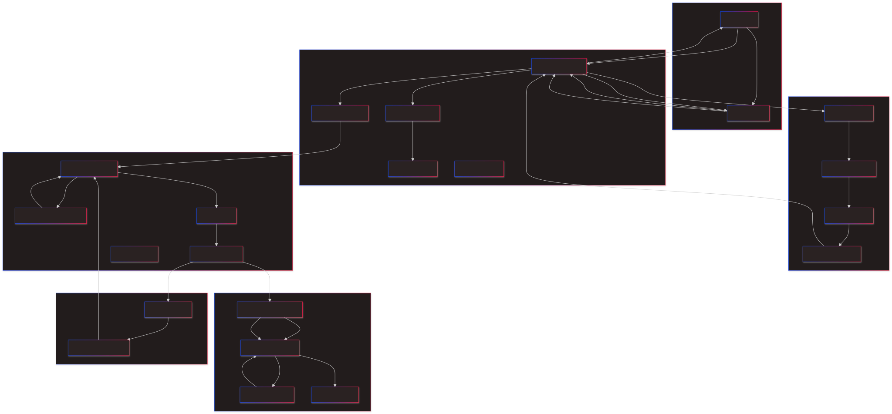

# 🎵 Video to MP3 Converter — Microservices Platform

[](https://github.com/vaibhavgagneja/Youtube_Video_converter/actions/workflows/ci.yml)
[](https://github.com/vaibhavgagneja/Youtube_Video_converter/actions/workflows/cd.yml)

A **production-grade**, cloud-native microservices platform that converts video files to MP3. Built with Python/Flask, deployed on Kubernetes with full CI/CD, monitoring, and Infrastructure as Code.

> **DevOps Highlights:** CI/CD (GitHub Actions) • Helm Charts • Terraform (AWS EKS) • Prometheus + Grafana • Docker Multi-stage Builds • Network Policies • HPA + PDB

---

## 📐 Architecture



| Service | Tech Stack | Purpose |
|---------|-----------|---------|
| **Gateway** | Flask, MongoDB, RabbitMQ | API gateway — auth, upload, download |
| **Auth** | Flask, MySQL, JWT | User authentication & token validation |
| **Converter** | Python, ffmpeg, RabbitMQ | Video → MP3 conversion worker |
| **Notification** | Python, SMTP, RabbitMQ | Email notification worker |
| **RabbitMQ** | RabbitMQ 3.13 | Async message broker |
| **MongoDB** | MongoDB 7.0 | Video/MP3 file storage (GridFS) |
| **MySQL** | MySQL 8.0 | User credentials store |

### Request Flow

```
User → Gateway ─→ Auth (JWT validation)
                ├→ MongoDB (store video via GridFS)
                └→ RabbitMQ (publish "video" message)
                        ├→ Converter (consume, convert, publish "mp3" message)
                        └→ Notification (consume, send email with download ID)
User ← Gateway ← MongoDB (download MP3 via GridFS)
```

---

## 🚀 Quick Start

### Prerequisites

- Docker & Docker Compose
- Python 3.12+
- `make` (optional but recommended)

### 1. Clone & Configure

```bash
git clone https://github.com/vaibhavgagneja/Youtube_Video_converter.git
cd Youtube_Video_converter
cp .env.example .env    # Edit with your actual values
```

### 2. Start All Services

```bash
# Using Make (recommended)
make up

# Or directly
docker-compose up -d --build
```

### 3. Verify

```bash
# Check health
curl http://localhost:8080/health
curl http://localhost:5000/health

# Login
curl -X POST http://localhost:8080/login \
  -u georgio@email.com:Admin123

# Upload a video (use the JWT from login)
curl -X POST http://localhost:8080/upload \
  -H "Authorization: Bearer <your-jwt>" \
  -F "file=@video.mp4"
```

### 4. Start Monitoring Stack (optional)

```bash
docker-compose -f docker-compose.yml -f docker-compose.monitoring.yml up -d
```

- **Prometheus:** http://localhost:9090
- **Grafana:** http://localhost:3000 (admin/admin)

---

## 🏗️ Project Structure

```
.
├── .github/workflows/       # CI/CD pipelines
│   ├── ci.yml               # Lint → Test → Build → Security Scan
│   └── cd.yml               # Staging → Production deployment
├── src/
│   ├── auth/                # Auth microservice
│   ├── gateway/             # API Gateway microservice
│   ├── converter/           # Video→MP3 converter worker
│   ├── notification/        # Email notification worker
│   └── rabbit/              # RabbitMQ K8s manifests
├── helm/video-converter/    # Helm chart
│   ├── templates/           # Templated K8s resources
│   ├── values.yaml          # Default values
│   ├── values-staging.yaml  # Staging overrides
│   └── values-production.yaml
├── terraform/               # AWS EKS infrastructure
│   ├── main.tf              # Provider & backend config
│   ├── eks.tf               # VPC + EKS cluster
│   ├── variables.tf         # Input variables
│   └── outputs.tf           # Cluster outputs
├── monitoring/              # Observability stack
│   ├── prometheus/          # Prometheus config
│   └── grafana/             # Dashboards & provisioning
├── docker-compose.yml       # Local development stack
├── docker-compose.monitoring.yml
├── Makefile                 # Developer commands
└── .env.example             # Environment template
```

---

## 🔄 CI/CD Pipeline

```
Push to main
    │
    ▼
┌──────────┐   ┌──────────┐   ┌──────────┐   ┌───────────────┐
│  Lint    │──▶│  Test    │──▶│  Build   │──▶│ Security Scan │
│ (flake8) │   │ (pytest) │   │ (Docker) │   │   (Trivy)     │
└──────────┘   └──────────┘   └──────────┘   └───────┬───────┘
                                                       │
                                                       ▼
                                             ┌──────────────────┐
                                             │ Deploy to        │
                                             │ Staging (Helm)   │
                                             └────────┬─────────┘
                                                      │ manual gate
                                                      ▼
                                             ┌──────────────────┐
                                             │ Deploy to        │
                                             │ Production       │
                                             └──────────────────┘
```

---

## ☸️ Kubernetes Features

| Feature | Implementation |
|---------|---------------|
| **Helm Chart** | Parameterized deployments with environment-specific values |
| **Health Probes** | Liveness + readiness on `/health` for all HTTP services |
| **HPA** | Auto-scaling for gateway (2-5 pods) and converter (2-10 pods) |
| **PDB** | Pod disruption budgets — minimum 1 pod always available |
| **Network Policies** | Zero-trust: default deny + explicit allow per service |
| **Resource Limits** | CPU/memory requests and limits on all containers |
| **Rolling Updates** | Zero-downtime deployments with `maxSurge=1, maxUnavailable=0` |

### Deploy with Helm

```bash
# Staging
helm upgrade --install video-converter helm/video-converter \
  --namespace staging --create-namespace \
  --values helm/video-converter/values-staging.yaml

# Production
helm upgrade --install video-converter helm/video-converter \
  --namespace production --create-namespace \
  --values helm/video-converter/values-production.yaml
```

---

## 🌍 Infrastructure (Terraform)

Provision the entire AWS infrastructure:

```bash
cd terraform
terraform init
terraform plan -var="environment=staging"
terraform apply -var="environment=staging"

# Configure kubectl
aws eks update-kubeconfig --region us-east-1 --name video-converter-cluster
```

**Resources provisioned:**
- VPC with 3 AZs, public/private subnets, NAT gateway
- EKS cluster with managed node groups
- Spot instances for converter workloads (cost optimization)
- EBS CSI driver for persistent volumes

---

## 🧪 Testing

```bash
# Run all tests
make test

# Run tests for a specific service
cd src/auth && python -m pytest tests/ -v --cov=.
```

---

## 📊 Monitoring

| Tool | URL | Purpose |
|------|-----|---------|
| Prometheus | `:9090` | Metrics collection & alerting |
| Grafana | `:3000` | Dashboards & visualization |
| RabbitMQ Management | `:15672` | Queue monitoring |

Pre-built Grafana dashboards include: request rate, p50/p95 latency, error rate, and service health.

---

## 🛠️ Makefile Commands

```bash
make help           # Show all commands
make up             # Start all services
make down           # Stop all services
make build          # Build Docker images
make push           # Push to Docker Hub
make test           # Run all tests
make lint           # Run flake8 linter
make deploy-staging # Deploy via Helm to staging
make helm-lint      # Lint the Helm chart
make clean          # Remove containers & build artifacts
```

---

## 📚 Documentation

- [Architecture Guide](docs/ARCHITECTURE.md) — System design deep dive
- [Contributing Guide](docs/CONTRIBUTING.md) — Development workflow
- [Operational Runbook](docs/RUNBOOK.md) — Troubleshooting & scaling

---

## 📄 License

MIT
